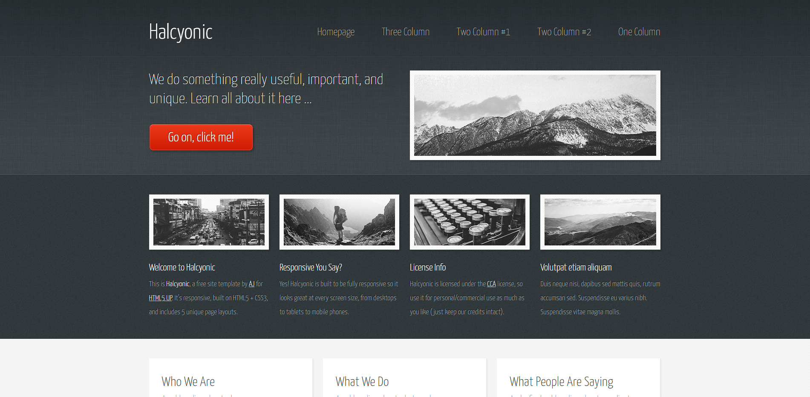
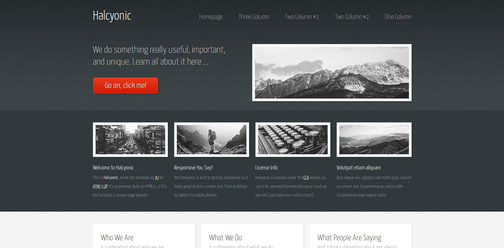

# Halcyonic

This project is an imitation of this responsive web page: [Real Page](https://html5up.net/uploads/demos/halcyonic/index.html).

## View Online

You can see the result hosted on [GitHub Pages](https://gianelli99.github.io/halcyonic/).

## Built with

- HTML
- CSS

## License

[MIT](https://github.com/GianElli99/halcyonic/blob/main/LICENSE)

## Screenshots

|                                Base                                 |
| :-----------------------------------------------------------------: |
|       |
|                             **Result**                              |
|  |

|                             Base                              |                               Result                               |
| :-----------------------------------------------------------: | :----------------------------------------------------------------: |
|  |  |
